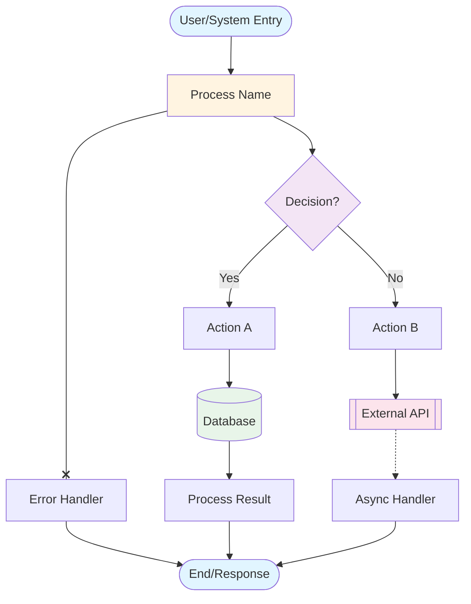

# Application Flow Chart Generator

## Goal
Analyze the entire application codebase and generate a comprehensive, consistent flowchart that visualizes the application's architecture, data flow, and key interactions.

## CRITICAL: You MUST create the markdown file(s) - do not just output the content!

## Usage
- Run without arguments: `claude-code flow_chart.md` - Analyzes the current directory
- Run with subfolder: `claude-code flow_chart.md ./backend` - Analyzes the specified subfolder
- Run with multiple apps: `claude-code flow_chart.md ./frontend ./backend` - Analyzes each app separately

## Instructions

### 1. Determine Target Directory
- If an argument is provided (e.g., `./backend`), analyze that specific subfolder
- If no argument is provided, analyze the current directory
- If multiple arguments are provided, create separate flowcharts for each
- First, list the directory structure to confirm the target location

### 2. Analyze the Codebase
Examine the project structure in the target directory:
- Identify the main entry point(s)
- Locate routing/navigation logic
- Find data models and schemas
- Identify API endpoints or service layers
- Locate key business logic components
- Identify external integrations

### 2. Flowchart Structure Standards

Use Mermaid flowchart syntax with these consistent conventions:

**Node Shapes:**
- `[Rectangle]` - Standard processes/functions
- `([Rounded])` - Entry/exit points, user interfaces
- `{Diamond}` - Decision points/conditional logic
- `[(Database)]` - Data storage/models
- `[[Subroutine]]` - External services/APIs
- `[/Parallelogram/]` - Input/Output operations

**Arrow Types:**
- `-->` - Standard flow
- `-.->` - Async/background operations
- `==>` - Primary/critical path
- `--x` - Error/failure path

**CRITICAL Syntax Rules:**
- Node labels MUST NOT contain special characters: `%`, `{`, `}`, `#`, `@`, `# Application Flow Chart Generator

## Goal
Analyze the entire application codebase and generate a comprehensive, consistent flowchart that visualizes the application's architecture, data flow, and key interactions.

## CRITICAL: You MUST create the markdown file(s) - do not just output the content!

## Usage
- Run without arguments: `claude-code flow_chart.md` - Analyzes the current directory
- Run with subfolder: `claude-code flow_chart.md ./backend` - Analyzes the specified subfolder
- Run with multiple apps: `claude-code flow_chart.md ./frontend ./backend` - Analyzes each app separately

## Instructions

### 1. Determine Target Directory
- If an argument is provided (e.g., `./backend`), analyze that specific subfolder
- If no argument is provided, analyze the current directory
- If multiple arguments are provided, create separate flowcharts for each
- First, list the directory structure to confirm the target location

### 2. Analyze the Codebase
Examine the project structure in the target directory:
- Identify the main entry point(s)
- Locate routing/navigation logic
- Find data models and schemas
- Identify API endpoints or service layers
- Locate key business logic components
- Identify external integrations

### 2. Flowchart Structure Standards

Use Mermaid flowchart syntax with these consistent conventions:

**Node Shapes:**
- `[Rectangle]` - Standard processes/functions
- `([Rounded])` - Entry/exit points, user interfaces
- `{Diamond}` - Decision points/conditional logic
- `[(Database)]` - Data storage/models
- `[[Subroutine]]` - External services/APIs
- `[/Parallelogram/]` - Input/Output operations

, `^`, `&`, `*`
- If special characters are needed, use descriptive text instead (e.g., "Parse JSON Pattern" instead of "Parse %{JSON} Pattern")
- Avoid using programming syntax, regex patterns, or template literals in node labels
- Use simple, plain English descriptions for all node names
- Test complex labels by keeping them simple and clear

**Color Coding:**
- `style X fill:#e1f5ff` - Frontend/UI components (light blue)
- `style X fill:#fff4e1` - Backend/API components (light orange)
- `style X fill:#e8f5e9` - Database/Storage (light green)
- `style X fill:#fce4ec` - External services (light pink)
- `style X fill:#f3e5f5` - Authentication/Security (light purple)

### 3. Chart Organization

Create a hierarchical flowchart with these sections:

1. **User Entry Points** - How users access the application
2. **Authentication Flow** - Login/auth processes (if applicable)
3. **Main Application Flow** - Core user journeys
4. **Data Flow** - How data moves through the system
5. **External Interactions** - Third-party services, APIs

**IMPORTANT: Mermaid Syntax Restrictions**
- All node labels must use plain text only
- Forbidden characters in labels: `%`, `{`, `}`, `#`, `@`, `# Application Flow Chart Generator

## Goal
Analyze the entire application codebase and generate a comprehensive, consistent flowchart that visualizes the application's architecture, data flow, and key interactions.

## CRITICAL: You MUST create the markdown file(s) - do not just output the content!

## Usage
- Run without arguments: `claude-code flow_chart.md` - Analyzes the current directory
- Run with subfolder: `claude-code flow_chart.md ./backend` - Analyzes the specified subfolder
- Run with multiple apps: `claude-code flow_chart.md ./frontend ./backend` - Analyzes each app separately

## Instructions

### 1. Determine Target Directory
- If an argument is provided (e.g., `./backend`), analyze that specific subfolder
- If no argument is provided, analyze the current directory
- If multiple arguments are provided, create separate flowcharts for each
- First, list the directory structure to confirm the target location

### 2. Analyze the Codebase
Examine the project structure in the target directory:
- Identify the main entry point(s)
- Locate routing/navigation logic
- Find data models and schemas
- Identify API endpoints or service layers
- Locate key business logic components
- Identify external integrations

### 2. Flowchart Structure Standards

Use Mermaid flowchart syntax with these consistent conventions:

**Node Shapes:**
- `[Rectangle]` - Standard processes/functions
- `([Rounded])` - Entry/exit points, user interfaces
- `{Diamond}` - Decision points/conditional logic
- `[(Database)]` - Data storage/models
- `[[Subroutine]]` - External services/APIs
- `[/Parallelogram/]` - Input/Output operations

**Arrow Types:**
- `-->` - Standard flow
- `-.->` - Async/background operations
- `==>` - Primary/critical path
- `--x` - Error/failure path

**CRITICAL Syntax Rules:**
- Node labels MUST NOT contain special characters: `%`, `{`, `}`, `#`, `@`, `# Application Flow Chart Generator

## Goal
Analyze the entire application codebase and generate a comprehensive, consistent flowchart that visualizes the application's architecture, data flow, and key interactions.

## CRITICAL: You MUST create the markdown file(s) - do not just output the content!

## Usage
- Run without arguments: `claude-code flow_chart.md` - Analyzes the current directory
- Run with subfolder: `claude-code flow_chart.md ./backend` - Analyzes the specified subfolder
- Run with multiple apps: `claude-code flow_chart.md ./frontend ./backend` - Analyzes each app separately

## Instructions

### 1. Determine Target Directory
- If an argument is provided (e.g., `./backend`), analyze that specific subfolder
- If no argument is provided, analyze the current directory
- If multiple arguments are provided, create separate flowcharts for each
- First, list the directory structure to confirm the target location

### 2. Analyze the Codebase
Examine the project structure in the target directory:
- Identify the main entry point(s)
- Locate routing/navigation logic
- Find data models and schemas
- Identify API endpoints or service layers
- Locate key business logic components
- Identify external integrations

### 2. Flowchart Structure Standards

Use Mermaid flowchart syntax with these consistent conventions:

**Node Shapes:**
- `[Rectangle]` - Standard processes/functions
- `([Rounded])` - Entry/exit points, user interfaces
- `{Diamond}` - Decision points/conditional logic
- `[(Database)]` - Data storage/models
- `[[Subroutine]]` - External services/APIs
- `[/Parallelogram/]` - Input/Output operations

, `^`, `&`, `*`
- If special characters are needed, use descriptive text instead (e.g., "Parse JSON Pattern" instead of "Parse %{JSON} Pattern")
- Avoid using programming syntax, regex patterns, or template literals in node labels
- Use simple, plain English descriptions for all node names
- Test complex labels by keeping them simple and clear

**Color Coding:**
- `style X fill:#e1f5ff` - Frontend/UI components (light blue)
- `style X fill:#fff4e1` - Backend/API components (light orange)
- `style X fill:#e8f5e9` - Database/Storage (light green)
- `style X fill:#fce4ec` - External services (light pink)
- `style X fill:#f3e5f5` - Authentication/Security (light purple)

, `^`, `&`, `*`, `/`, `\`, `<`, `>`, `|`
- Replace code syntax with descriptive text:
  - ❌ "Parse %{JSON}" → ✅ "Parse JSON Pattern"
  - ❌ "Match /regex/" → ✅ "Match Text Pattern"
  - ❌ "Process ${var}" → ✅ "Process Variable"
- Keep labels simple and human-readable

### 4. Generation Process

Follow this process:
1. Read and analyze all source files
2. Map out the main flows (start with entry points)
3. Identify decision points and branches
4. Document data transformations
5. Note external dependencies
6. Create the Mermaid flowchart
7. Apply consistent styling

### 5. Output Format

Generate a Mermaid flowchart that:
- Uses clear, descriptive node labels
- Groups related functionality
- Shows both happy path and error handling
- Includes legends for node types
- Has a clear top-to-bottom or left-to-right flow
- Limits complexity (break into multiple charts if needed)

### 6. Template Structure

### 7. Best Practices

- Keep node IDs short but meaningful (e.g., `auth`, `db`, `api1`)
- Use consistent naming conventions
- Group subgraphs for complex sections
- Add comments in the Mermaid code to explain sections
- Test the chart renders correctly
- **CRITICAL: Avoid special characters in node labels** - No `%`, `{`, `}`, `#`, `@`, `# Application Flow Chart Generator

## Goal
Analyze the entire application codebase and generate a comprehensive, consistent flowchart that visualizes the application's architecture, data flow, and key interactions.

## CRITICAL: You MUST create the markdown file(s) - do not just output the content!

## Usage
- Run without arguments: `claude-code flow_chart.md` - Analyzes the current directory
- Run with subfolder: `claude-code flow_chart.md ./backend` - Analyzes the specified subfolder
- Run with multiple apps: `claude-code flow_chart.md ./frontend ./backend` - Analyzes each app separately

## Instructions

### 1. Determine Target Directory
- If an argument is provided (e.g., `./backend`), analyze that specific subfolder
- If no argument is provided, analyze the current directory
- If multiple arguments are provided, create separate flowcharts for each
- First, list the directory structure to confirm the target location

### 2. Analyze the Codebase
Examine the project structure in the target directory:
- Identify the main entry point(s)
- Locate routing/navigation logic
- Find data models and schemas
- Identify API endpoints or service layers
- Locate key business logic components
- Identify external integrations

### 2. Flowchart Structure Standards

Use Mermaid flowchart syntax with these consistent conventions:

**Node Shapes:**
- `[Rectangle]` - Standard processes/functions
- `([Rounded])` - Entry/exit points, user interfaces
- `{Diamond}` - Decision points/conditional logic
- `[(Database)]` - Data storage/models
- `[[Subroutine]]` - External services/APIs
- `[/Parallelogram/]` - Input/Output operations

**Arrow Types:**
- `-->` - Standard flow
- `-.->` - Async/background operations
- `==>` - Primary/critical path
- `--x` - Error/failure path

**CRITICAL Syntax Rules:**
- Node labels MUST NOT contain special characters: `%`, `{`, `}`, `#`, `@`, `# Application Flow Chart Generator

## Goal
Analyze the entire application codebase and generate a comprehensive, consistent flowchart that visualizes the application's architecture, data flow, and key interactions.

## CRITICAL: You MUST create the markdown file(s) - do not just output the content!

## Usage
- Run without arguments: `claude-code flow_chart.md` - Analyzes the current directory
- Run with subfolder: `claude-code flow_chart.md ./backend` - Analyzes the specified subfolder
- Run with multiple apps: `claude-code flow_chart.md ./frontend ./backend` - Analyzes each app separately

## Instructions

### 1. Determine Target Directory
- If an argument is provided (e.g., `./backend`), analyze that specific subfolder
- If no argument is provided, analyze the current directory
- If multiple arguments are provided, create separate flowcharts for each
- First, list the directory structure to confirm the target location

### 2. Analyze the Codebase
Examine the project structure in the target directory:
- Identify the main entry point(s)
- Locate routing/navigation logic
- Find data models and schemas
- Identify API endpoints or service layers
- Locate key business logic components
- Identify external integrations

### 2. Flowchart Structure Standards

Use Mermaid flowchart syntax with these consistent conventions:

**Node Shapes:**
- `[Rectangle]` - Standard processes/functions
- `([Rounded])` - Entry/exit points, user interfaces
- `{Diamond}` - Decision points/conditional logic
- `[(Database)]` - Data storage/models
- `[[Subroutine]]` - External services/APIs
- `[/Parallelogram/]` - Input/Output operations

, `^`, `&`, `*`
- If special characters are needed, use descriptive text instead (e.g., "Parse JSON Pattern" instead of "Parse %{JSON} Pattern")
- Avoid using programming syntax, regex patterns, or template literals in node labels
- Use simple, plain English descriptions for all node names
- Test complex labels by keeping them simple and clear

**Color Coding:**
- `style X fill:#e1f5ff` - Frontend/UI components (light blue)
- `style X fill:#fff4e1` - Backend/API components (light orange)
- `style X fill:#e8f5e9` - Database/Storage (light green)
- `style X fill:#fce4ec` - External services (light pink)
- `style X fill:#f3e5f5` - Authentication/Security (light purple)

### 3. Chart Organization

Create a hierarchical flowchart with these sections:

1. **User Entry Points** - How users access the application
2. **Authentication Flow** - Login/auth processes (if applicable)
3. **Main Application Flow** - Core user journeys
4. **Data Flow** - How data moves through the system
5. **External Interactions** - Third-party services, APIs

### 4. Generation Process

Follow this process:
1. Read and analyze all source files
2. Map out the main flows (start with entry points)
3. Identify decision points and branches
4. Document data transformations
5. Note external dependencies
6. Create the Mermaid flowchart
7. Apply consistent styling

### 5. Output Format

Generate a Mermaid flowchart that:
- Uses clear, descriptive node labels
- Groups related functionality
- Shows both happy path and error handling
- Includes legends for node types
- Has a clear top-to-bottom or left-to-right flow
- Limits complexity (break into multiple charts if needed)

### 6. Template Structure

, `^`, `&`, `*` in labels
- Use plain English descriptions instead of code syntax or regex patterns
- Example: Use "Parse JSON Data" NOT "Parse %{JSON} Pattern"
- Example: Use "Match Text Pattern" NOT "Match /regex/ Pattern"
- If the application is very large, create multiple focused charts:
  - Authentication Flow
  - Data Flow
  - API Request Flow
  - User Journey Flow

### 8. Deliverable

Provide:
1. The complete Mermaid flowchart code
2. A brief description of the main flows identified
3. Any notable patterns or architectural decisions observed
4. Suggestions for improvements if any bottlenecks or issues are identified

## Example Output Format

Start your response with:
"I've analyzed the application and created a flowchart showing [brief description of what the chart covers]."

Then provide the Mermaid code block and any relevant observations.